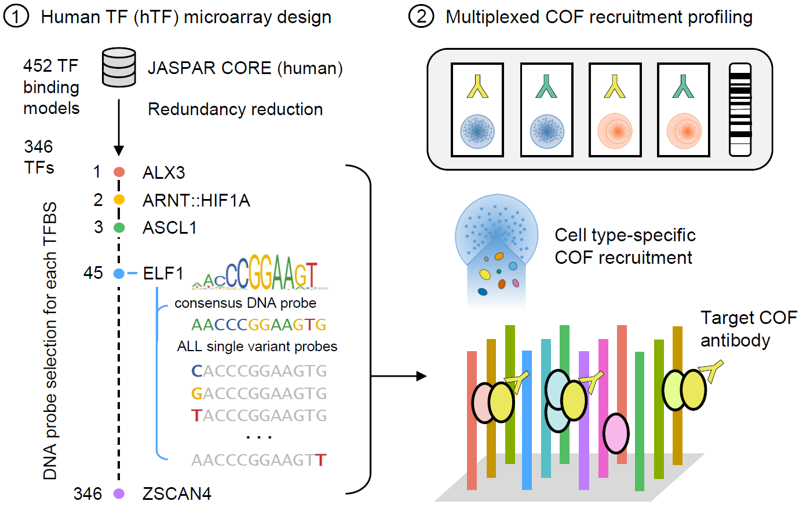

# hTF_array
Design and analysis scripts for the human transcription factor (hTF) protein-binding microarray

## Introduction
The human transcription factor (hTF) array is an experimental protein-binding microarray platform designed to characterize transcriptional cofactor (COF) recruitment to consensus TF binding sites in a cell state-dependent manner.

**1. Human TF (hTF) microarray design:**  
346 consensus TF binding sites from the JASPAR 2018 CORE as well as all of their single nucleotide variants are included as DNA probes on the microarray design. The single nucleotide variant probes allow for empirical measurement of the differences in COF recruitment attributable to different nucleotides.

**2. Multiplexed COF recruitment profiling:**  
Profiling COF recruitment directly from nuclear extracts (nextPBM) allows us to determine 1) which TFs are capable of recruiting a COF/subunit of interest and 2) how nucleotide variants of the consensus TF site affect the subsequent recruitment of the COF - known as the COF recruitment motif. The collection of TFs and recruitment preferences effectively become a signature that can be used to define the COF-TF complexes active in a given cell state. Changes to this profile in aberrant cell states (such as cancer) may provide insight as to which complexes are involved with mediating these aberrant states. The microarray design itself is a 4-chamber 180K probe design (allowing for 4 different experiments in a single array) and is available for purchase from Agilent (Design ID: 086290).

## File descriptions
The following are short descriptions of each of the files included in this repository. For more information, check out the sections that follow.
|Name |Description |
|-----|------------|
| hTF_v01_nextPBM_design.R | the open-source R script used to design v01 of the hTF array |
| app.R | shiny app used to explore, analyze, and visualize the results from hTF array experiments |
| HTF_V01_020520_FULL_ANNOT_v1_a1_run1_ZSCORES.dat | sample dataset of real experimental results obtained using the hTF array (v01) |
