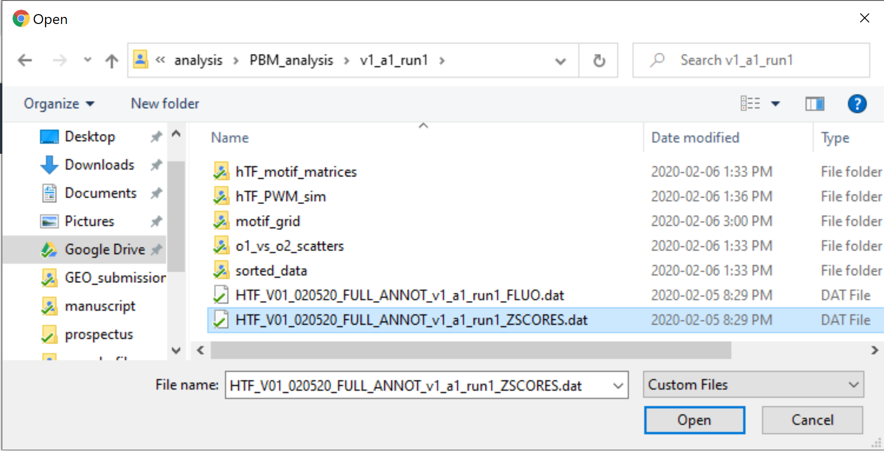

# hTF_array
Design, analysis, and visualization software for the human transcription factor (hTF) protein-binding microarray

## Introduction
The human transcription factor (hTF) array is an experimental protein-binding microarray platform designed to characterize transcriptional cofactor (COF) recruitment to consensus TF binding sites in a cell state-dependent manner.

1. Human TF (hTF) microarray design:  
346 consensus TF binding sites from the JASPAR 2018 CORE as well as all of their single nucleotide variants are included as DNA probes on the microarray design. The single nucleotide variant probes allow for empirical measurement of the differences in COF recruitment attributable to different nucleotides.

2. Multiplexed COF recruitment profiling:  
Profiling COF recruitment directly from nuclear extracts (nextPBM) allows us to determine 1) which TFs are capable of recruiting a COF/subunit of interest without having to directly profile the binding of each TF and 2) how nucleotide variants of the consensus TF site affect the subsequent recruitment of the COF - known as the COF recruitment motif. The collection of TFs and recruitment preferences effectively become a signature that can be used to define the COF-TF complexes active in a given cell state. Changes to this profile in aberrant cell states (such as cancer) may provide insight as to which complexes are involved in establishing and/or maintaining these aberrant states. The microarray design itself is a 4-chamber 180K probe design (allowing for 4 different experiments in a single array) and is available for purchase from Agilent (Design ID: 086290).

## File descriptions
The following are short descriptions of each of the files included in this repository. For more information, check out the sections that follow.
|Name |Description |
|-----|------------|
| hTF_v01_nextPBM_design.R | the open-source R script used to design v01 of the hTF array |
| app.R | shiny app used to explore, analyze, and visualize the results from hTF array experiments |
| HTF_V01_020520_FULL_ANNOT_v1_a1_run1_ZSCORES.dat | sample dataset of real experimental results obtained using the hTF array (v01) |

## Array design details

## Analysis overview
The hTF array design comes bundled with a dedicated analysis applet. The app can be deployed offline directly from RStudio using the `app.R` file included in this repository. The following is an overview for how to explore, analyze, and visualize real hTF array experimental results.

### Uploading data
To begin exploring your hTF array results, simply upload your data to the app by selecting the `Browse...` button on the first page:

Clicking the button opens up a file browser where you can upload your experimental data. For this example, I'm going to use the `HTF_V01_020520_FULL_ANNOT_v1_a1_run1_ZSCORES.dat` file included in this repository.

### Data explorer
After uploading your data, an interative table is rendered where you can explore which TF sites demonstrated the highest COF recruitment levels in each experiment performed. For example, clicking the `LPS_PMA_P300` column (orange arrow below) will sort the data by which sites recruited the coactivator p300 the best in this experiment from LPS-stimulated, PMA-differentiated THP-1 macrophages. The top results are dominated by IRFs which are known LPS-responsive TFs. Looking at the `UT_PMA_P300` column immediately to the left, we can see that these same TFs do not recruit p300 in the untreated (UT) condition.

The data explorer provides a general portal through which you can decide which TFs you should include in the subsequent analysis steps.

### Scatterplots
Clicking the `Scatterplots` tab at the top of the page opens a portal that you can use to create customized pairwise comparison plots between different experiments performed on your hTF array. 

In the above example, I've selected to compare p300 recruitment to a diverse group of TFs in LPS-stimulated macrophages (y-axis) compared to an untreated control (x-axis). The colors show the consensus as well as single nucleotide variant probes associated with a given TF in the hTF array design. You can see that probes associated with the IRFs (highlighted in the "Data explorer" step) are strong LPS-dependent p300 recruiters (depending on the given variant probe being examined) whereas SPI1 and SPIB (constitutively expressed ETS factors) recruit p300 much better in the unstimulated macrophages. NF-kB TFs (REL and RELA) are also strongly LPS-dependent but appear to be weaker p300 recruiters compared to the IRFs. In contrast with SPI1/SPIB, closely related ETS factors ELF1 and ETV2 appear to be decent p300 recruiters in both LPS-stimulated and untreated macrophages.

If you are interested in including many more TFs and the automatically generated color palette starts to become less distinguishable, you can click the `Family-level comparison` tab to look at probes grouped by their TF family as opposed to the individual factors as shown below.

### Motif grid

An advantage of using the hTF array platform over other technologies is the amount of insight gained by looking at a collection of single nucleotide variant probes to determine how individual nucleotides perturb/improve COF recruitment to consensus TF sites. The `Motif grid` portal integrates the COF recruitment results obtained at all of the probes associated with TF sites of interest to generate these COF recruitment models. For example, we can look at the recruitment preferences of p300 and the corepressor complex NCOR observed at 3 functionally distinct TF binding sites:

As shown above, both the coactivator p300 and the NCOR corepressor complex can be recruited to the SPI1 site albeit with distinct nucleotide preferences. The C-rich preferences observed in 3 of the experiments suggest there are conditions where closely-related ETS factors such as ELF1 might mediate recruitment to the canonical SPI1 site as the recruitment model obtained experimentally is more consistent with ELF1 binding preferences. In contrast to the SPI1 consensus site, the RELA site supports only the recruitment of p300 and in an LPS-dependent manner. This is consistent with NF-kB activation and translocation into the nucleus during the pro-inflammatory response. The recruitment model obtained by integrating results over all single nucleotide variant probes associated with the RELA consensus is concordant with the characterized RELA TF binding model. Finally, though the RARA::RXRA complex does not appear to recruit p300, it demonstrates moderate constitutive recruitment of the NCOR corepressor complex. The empirical NCOR recruitment models for these sites are concordant across cell states (LPS-stimulated and untreated macrophages) and strongly resemble canonical nuclear receptor binding models. These represent only a few of the comparisons possible within a single set of hTF array experiments.

### Recruitment heatmap

This module is currently under construction. It will hopefully one day allow users to build summary recruitment "profiles" or "signatures" that summarizes COF recruitment to hundreds of TF sites in a given cell state. Alterations to these signatures in aberrant cell states (such as cancer) could be used to investigate which COF-TF complexes are involved.

