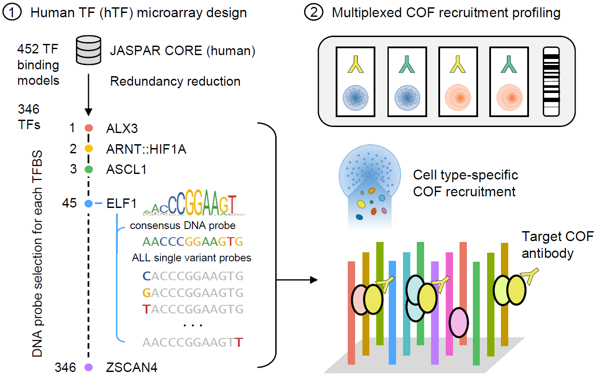
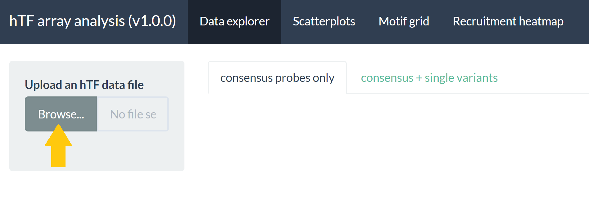
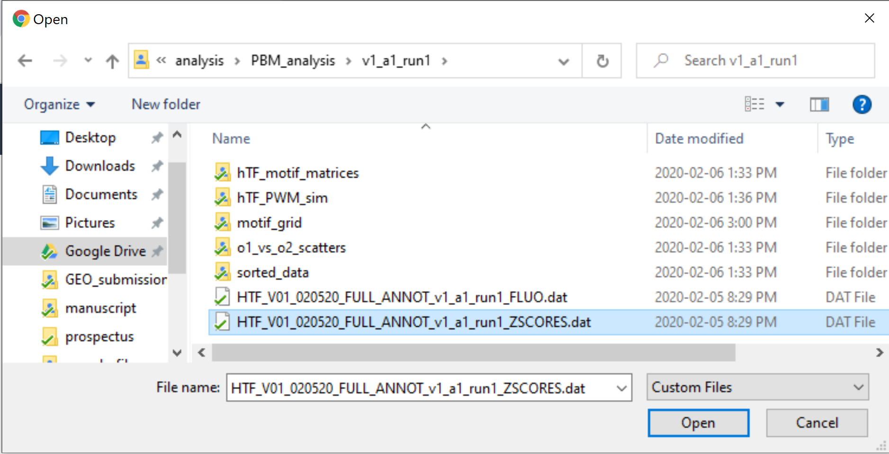
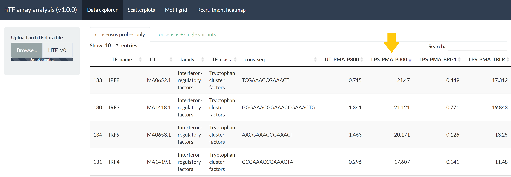
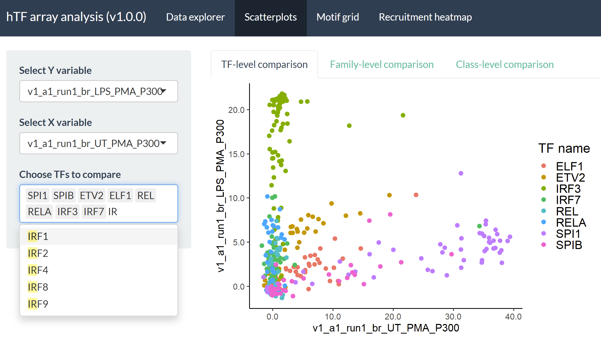
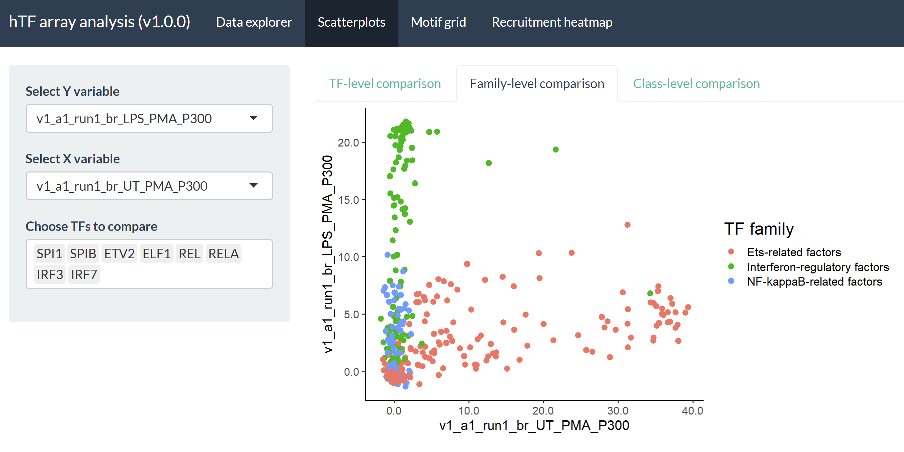
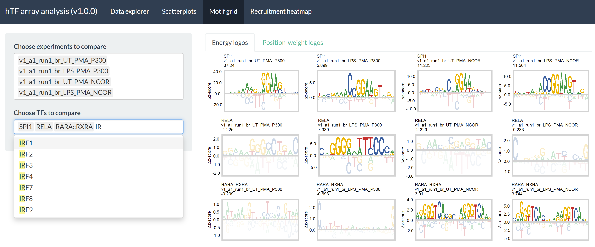
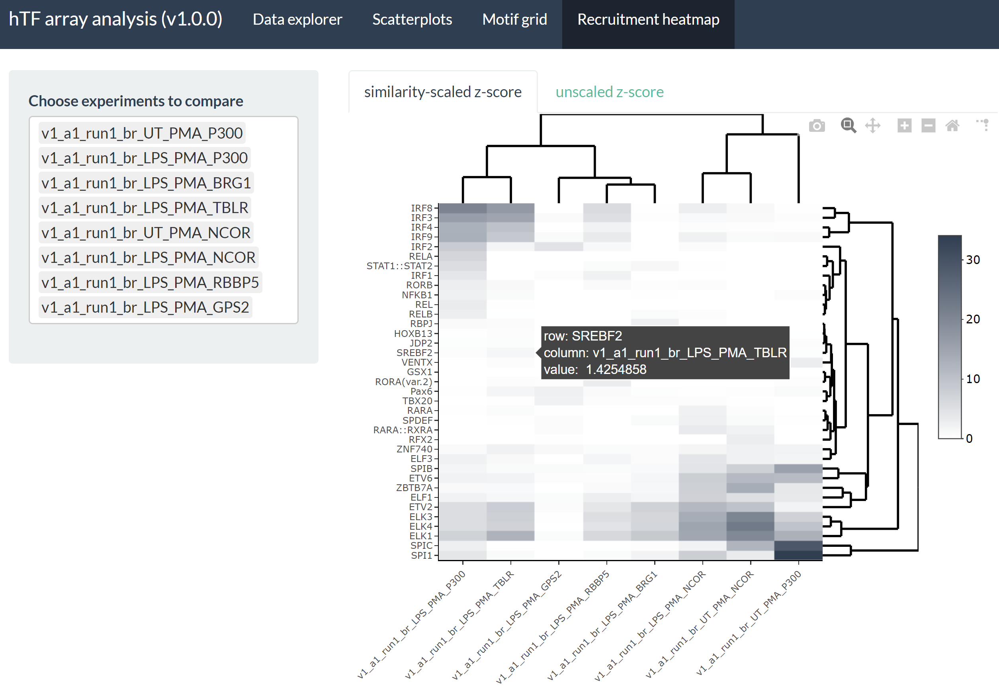

# hTF_array
Design, analysis, and visualization software for the human transcription factor (hTF) protein-binding microarray

## Introduction
The human transcription factor (hTF) array is an experimental protein-binding microarray platform designed to characterize transcriptional cofactor (COF) recruitment to consensus TF binding sites in a cell state-dependent manner.



1. Human TF (hTF) microarray design: <br>
346 consensus TF binding sites from the JASPAR 2018 CORE as well as all of their single nucleotide variants are included as DNA probes on the microarray design. The single nucleotide variant probes allow for empirical measurement of the differences in COF recruitment attributable to different nucleotides.

2. Multiplexed COF recruitment profiling: <br>
Profiling COF recruitment directly from nuclear extracts (nextPBM) allows us to determine 1) which TFs are capable of recruiting a COF/subunit of interest without having to directly profile the binding of each TF and 2) how nucleotide variants of the consensus TF site affect the subsequent recruitment of the COF - known as the COF recruitment motif. The collection of TFs and recruitment preferences effectively become a signature that can be used to define the COF-TF complexes active in a given cell state. Changes to this profile in aberrant cell states (such as cancer) may provide insight as to which complexes are involved in establishing and/or maintaining these aberrant states. The microarray design itself is a 4-chamber 180K probe design (allowing for 4 different experiments in a single array) and is available for purchase from Agilent (Design ID: 086290).

## File descriptions
The following are short descriptions of each of the files included in this repository. For more information, check out the sections that follow.
|Name |Description |
|-----|------------|
| hTF_v01_nextPBM_design.R | the open-source R script used to design v01 of the hTF array |
| app.R | shiny app used to explore, analyze, and visualize the results from hTF array experiments |
| HTF_V01_020520_FULL_ANNOT_v1_a1_run1_ZSCORES.dat | sample dataset of real experimental results obtained using the hTF array (v01) |

## Analysis overview
The hTF array design comes bundled with a dedicated analysis applet. The app can be deployed offline directly from RStudio using the `app.R` file included in this repository. The following is an overview for how to explore, analyze, and visualize real hTF array experimental results.

### Uploading data
To begin exploring your hTF array results, simply upload your data to the app by selecting the `Browse...` button on the first page:



Clicking the button opens up a file browser where you can upload your experimental data. For this example, I'm going to use the `HTF_V01_020520_FULL_ANNOT_v1_a1_run1_ZSCORES.dat` file included in this repository.



### Data explorer
After uploading your data, an interactive table is rendered where you can explore which TF sites demonstrated the highest COF recruitment levels in each experiment performed. For example, clicking the `LPS_PMA_P300` column (orange arrow below) will sort the data by which sites recruited the coactivator p300 the best in this experiment from LPS-stimulated, PMA-differentiated THP-1 macrophages. The top results are dominated by IRFs which are known LPS-responsive TFs. Looking at the `UT_PMA_P300` column immediately to the left, we can see that these same TFs do not recruit p300 in the untreated (UT) condition.



The data explorer provides a general portal through which you can decide which TFs you should include in the subsequent analysis steps.

### Scatterplots
Clicking the `Scatterplots` tab at the top of the page opens a portal that you can use to create customized pairwise comparison plots between different experiments performed on your hTF array. 



In the above example, I've selected to compare p300 recruitment to a diverse group of TFs in LPS-stimulated macrophages (y-axis) compared to an untreated control (x-axis). The colors show the consensus as well as single nucleotide variant probes associated with a given TF in the hTF array design. You can see that probes associated with the IRFs (the TF group highlighted in the previous `Data explorer` step) are strong LPS-dependent p300 recruiters (depending on the given variant probe being examined) whereas SPI1 and SPIB (constitutively expressed ETS factors) recruit p300 much better in the unstimulated macrophages. NF-kB TFs (REL and RELA) are also strongly LPS-dependent but appear to be weaker p300 recruiters compared to the IRFs. In contrast with SPI1/SPIB, closely related ETS factors ELF1 and ETV2 appear to be decent p300 recruiters in both LPS-stimulated and untreated macrophages.

If you are interested in including many more TFs and the automatically generated color palette starts to become less distinguishable, you can click the `Family-level comparison` tab to look at probes grouped by their TF family as opposed to the individual factors as shown below.



### Motif grid

An advantage of using the hTF array platform over other technologies is the amount of insight gained by looking at a collection of single nucleotide variant probes to determine how individual nucleotides perturb/improve COF recruitment to consensus TF sites. The `Motif grid` portal integrates the COF recruitment results obtained at all of the probes associated with TF sites of interest to generate these COF recruitment models. For example, we can look at the recruitment preferences of p300 and the corepressor complex NCOR observed at 3 functionally distinct TF binding sites:



As shown above, both the coactivator p300 and the NCOR corepressor complex can be recruited to the SPI1 site albeit with distinct nucleotide preferences. The C-rich preferences observed in 3 of the experiments suggest there are conditions where closely-related ETS factors such as ELF1 might mediate recruitment to the canonical SPI1 site as the recruitment model obtained experimentally is more consistent with ELF1 binding preferences. In contrast to the SPI1 consensus site, the RELA site supports only the recruitment of p300 and in an LPS-dependent manner. This is consistent with NF-kB activation and translocation into the nucleus during the pro-inflammatory response. The recruitment model obtained by integrating results over all single nucleotide variant probes associated with the RELA consensus is concordant with the characterized RELA TF binding model. Finally, though the RARA::RXRA complex does not appear to recruit p300, it demonstrates moderate constitutive recruitment of the NCOR corepressor complex. The empirical NCOR recruitment models for these sites are concordant across cell states (LPS-stimulated and untreated macrophages) and strongly resemble canonical nuclear receptor binding models. These represent only a few of the comparisons possible within a single set of hTF array experiments.

### Recruitment heatmap

This module is currently under construction. It will hopefully one day allow users to build recruitment "profiles" or "signatures" that summarizes COF recruitment to hundreds of TF sites in a given cell state. Alterations to these signatures in aberrant cell states (such as cancer) could be used to investigate which COF-TF complexes are involved.



## Array design details

The hTF array design was generated using the `hTF_v01_nextPBM_design.R` file included in this repository. The microarray itself is available to purchase from Agilent (Design ID: 086290). In order to reconstitute the files and annotations associated with the design, simply run `hTF_v01_nextPBM_design.R` as an Rscript as follows:
```shell
Rscript hTF_v01_nextPBM_design.R hTF_v01
```
The only argument is a prefix to use while naming the individual DNA probes and the design as a whole. In the above example, I've used `hTF_v01` as this prefix. The script depends on several R and bioconductor packages, so if you would like to rerun it, please install the following first:
* `TFBSTools`
* `JASPAR2018`
* `plyr`

The following are each of the steps executed in the design Rscript to build the array design starting from the TF binding models included in the open-source JASPAR 2018 database.

### 1. Obtain all core TF motifs in the JASPAR database and their consensus sequences
* The `JASPAR2018` bioconductor R package was used to fetch the motif matrices from the database
* The CORE set of motifs consists of a non-redundant, curated 1,564 motif matrices across many model organisms
* This initial set was filtered for vertebrate CORE motifs with a human source (ie. used human cell lines/tissues for their characterization)
* This filter resulted in 452 total human TF binding motifs

### 2. Flag "equivalent" motif seed sequences for "filtering" form final design
* Each of these 452 motifs were collapsed into a single consensus sequence (per motif) using the highest-scoring nucleotide within each position
* These sequences were collapsed since a physical DNA probe on an array can represent at most 1 sequence. I reasoned that the consensus sequence would be the best to start with as the "seed" sequence for the single nucleotide variant probe generation
* An equivalence filter was then applied to examine which consensus sequences were identical or close enough to one another. This was accomplished by sorting the consensus sequences by size (largest to smallest), walking through each sequence systematically (starting with the largest), and adding them to a final list of consensus sequences to include in the array design. If a consensus sequence (or its reverse complement was found to be a subsequence (or exact match) of one already included in the list, the relative sizes of the matches were compared. If this relative size was found to be greater than 0.90, then the current sequence was flagged to be "filtered". The match within the final design was then tagged with the info from the current sequence to note that they are "equivalent".

### 3. Pad the consensus sequence to create the final target sequence and generate single nucleotide variant probes
* 2 flanking bases were added to both ends of the consensus sequence to account for possible additional recruitment preferences not captured in the TF binding model positions.
* Each 2 base pad was selected randomly from all possible non-repeating combinations of 2 nucleotides
* This procedure combined with the previous step resulted in 346 distinct consensus sequences to include in the final array design
* Single nucleotide variant probes for each of these modified consensus sequences were generated at this step. All possible single nucleotide variants of each consensus sequence were included in the final array design to model the difference in recruitment intensity attributable to a given variant at a given position within the consensus sequence.

### 4. Generate a backbone probe sequence
* To account for size differences between probes, a 34-base backbone was generated algorithmically such that each position was generated randomly but restricted to non-repeating nucleotides
* The collection of consensus sequences and all their SNVs were tested to make sure none were subsequences of the backbone
* The final backbone sequence generated for this v01 hTF design is: <br>
`GACTACTACGTGTCGACGATCGAGCACGCAGATC`
* Each target sequence generated as the result of step 3 was inserted into the 34-base backbone beginning at the 5' site (as far away from the glass slide as possible).

### 5. Construct final probes
* The total 34-base target region (the TF target and some portion of the backbone) for each probe was then included as part of a larger 60-base DNA probe as follows: <br>
`GC cap + 34-base target (TF site or SNV + backbone) + 24 base double-stranding primer`
* The array design also includes 261 background probes selected using random 34-base regions of the hg38 genome. These background probes are used by the analysis in order to normalize against background fluorescence intensity
* Each final probe on the array exists with the target in the reference direction and its reverse complement. Both versions of the probe are included 5x for a total of 10 internal replicates per probe.

### Design FAQ
`Q: Why was a size threshold used? Why not just filter a consensus sequence if it is a subsequence of a larger consensus sequence?` <br>
A: It may be biophysically important to study a half-site (ie. from a TF complex) or a core element in isolation from other half-sites or flanking bases for example. I wanted to avoid the situation where I would be filtering out half-sites or smaller, more degenerate sites for this reason.

`Q: Why was a relative size filter of 0.90 selected? Why not another number?` <br>
A: This choice was completely arbitrary. I adjusted it until I obtained a suitable number of final consensus sequences to fit within the limits of the Agilent 4x180K microarray design

`Q: What happened to all of the consensus sequences that were filtered out?` <br>
A: None of the 452 human JASPAR CORE motifs from the 2018 build were actually "filtered out". The ones that were determined to be duplicates or have close enough sequence identity to a consensus sequence on the design were simply flagged and added as "equivalent". Details can be viewed for individual TFs within the full array annotation or the sample results dataset.

